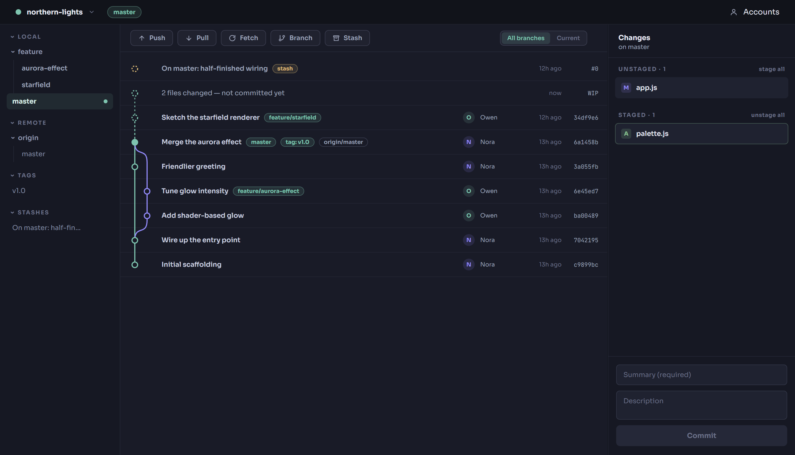

# Aurora

A cozy git client for Windows, built with Electron.

Aurora opens a repository and gives you the essentials in one calm, dark window: a branch graph of the commit history, staging and committing, remote sync with GitHub/GitLab sign-in, and stash, branch, and tag management — without the ceremony of the big clients.



## Features

### Commit graph
- Commits from **all branches interleaved** on colored lanes, with fork and merge curves — or flip the toolbar toggle to **Current** to see only your branch's history.
- Anything not part of your checked-out branch draws **dashed**: unmerged branch tips, fetched-but-not-pulled commits (marked *↓ incoming*), uncommitted work (the *WIP* ghost row), and stashes floating on top.
- Click a commit for its details: message, author, per-file change stats, and expandable diffs.
- Right-click a commit to **tag it** or copy its hash.
- Avatars are color-coded per author with initials; ref chips show branches and tags on their commits.

### Staging & committing
- Unstaged and staged files side by side; click a file to see its **diff inline** (including synthesized diffs for untracked files).
- Stage/unstage per file with the hover icons or all at once; **discard** unstaged changes (or delete untracked files) with a confirmation.
- Commit with a summary + optional description; errors surface inline.

### Branches, tags, stashes
- Click a branch to **check it out** — local or remote (a tracking branch is created automatically). Create branches from the toolbar; delete with confirmation, including a force-delete offer for unmerged branches.
- Prefixed branches (`feature/...`) group into **collapsible folders**; sidebar sections collapse too, and remember their state.
- Tag any commit (right-click or its detail panel), **push tags to origin** from the sidebar, delete with confirmation.
- Stash from the toolbar (untracked files included); **pop or drop** from the sidebar or the graph.

### Remotes & accounts
- Push / Pull / Fetch with **ahead/behind badges**, busy indicators, and readable error dialogs.
- **Sign in with GitHub or GitLab** in the browser (OAuth device flow — no secrets stored in the app), or paste a personal access token; self-hosted GitLab works with a token.
- Tokens are stored **encrypted** (Windows DPAPI) on your machine only; GitLab's short-lived tokens refresh automatically.

### Quality of life
- Repository switcher with a persistent repo list; open a specific repo via CLI argument.
- Resizable panels, compact rows, custom icon, no menu-bar clutter.
- A friendly setup screen if git isn't installed, and auto-refresh every few seconds and on window focus.

## Getting started

Requirements: [Node.js](https://nodejs.org) (v22 or later) and [git](https://git-scm.com/downloads) available on `PATH`.

```powershell
npm install
npm start                    # opens the last repository
npm start -- C:\path\to\repo # opens a specific repository
```

## Building an executable

```powershell
npm run pack   # quick unpacked build in dist\win-unpacked\
npm run dist   # portable Aurora <version>.exe + one-click installer in dist\
```

`npm run dist` produces two artifacts:

- **`Aurora <version>.exe`** — portable single-file build; run it from anywhere, optionally with a repository path as the first argument.
- **`Aurora Setup <version>.exe`** — one-click installer with a Start-menu entry and uninstaller.

The binaries are unsigned, so Windows SmartScreen shows a warning on first launch — choose *More info → Run anyway*.

## Releasing

Releases are built by GitHub Actions: pushing a `v*` tag (which you can do from Aurora itself — tag the commit, then push the tag from the sidebar) triggers `.github/workflows/release.yml`, which builds both artifacts on a Windows runner and attaches them to a **draft** GitHub release. Review and publish from the Releases page. Keep the tag in sync with the `version` in `package.json` — the artifacts are named after it.

## How it works

| File | Role |
|---|---|
| `main.js` | Electron main process; runs all git operations via [simple-git](https://github.com/steveukx/git-js) and exposes them over IPC, plus the OAuth device flows and encrypted token storage. |
| `preload.js` | Bridges the IPC handlers into the page as `window.aurora` via `contextBridge`. |
| `renderer/` | The UI — plain HTML/CSS/JS, no framework. Re-renders from fresh git state after every action; the branch graph is laid out client-side from the commit DAG and drawn as SVG. |
| `build/` | App icon (`icon.ico` + `icon.svg` source) used by the window and the packaged executable. |

The renderer never touches the filesystem or git directly; everything goes through the typed `window.aurora` API. Remote operations run with a sanitized environment and feed credentials to git via a generated askpass helper, so nothing blocks on hidden terminal prompts.
